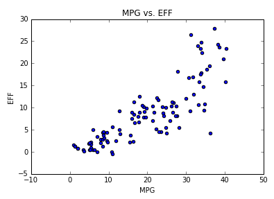
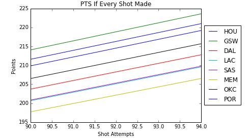
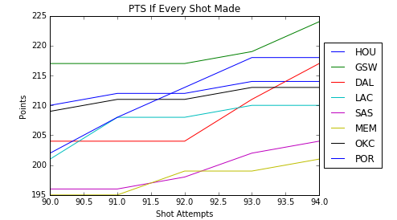
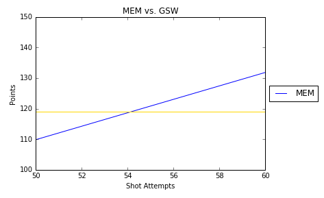
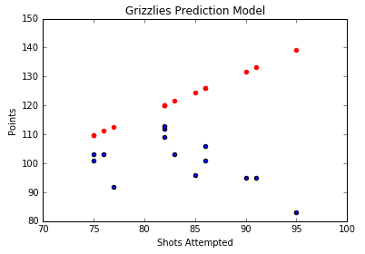

# NBA '16 Playoffs Exploratory Data Analysis

This project explores team and player performances in the 2016 Western Conference NBA playoffs.

### Data Source

All data was pulled from [Basketball Reference](http://www.basketball-reference.com/playoffs/NBA_2016.html).
All csv files are in the folder. Each csv file contains rows of a player on that specific team that had playing time in the playoffs.

### Data Manipulation

* Read in each dataframe and added a team name column to each player
* Joined all the dataframes into one dataframe.
* Used vector operations to create per game columns and any extra stats like efficiency

### Preliminary Findings

* Kevin Durant had the highest PPG at 28.4 ppg.
* Russell Westbrook had the highest efficiency at 27.9 and KD was not in the top 5 most efficient players
* DeAndre Jordan had the highest free throw attempts a game at 9.8 (hack-a-Jordan strategy)
* Golden State had the highest average efficiency per player at 9.6
* The Clippers had the most missed shots per game

### Data Findings with Graphs

Scatter plot of MPG vs. Efficiency. You can see 3 clusters form at 0-18 mins, 18-30 mins, and 30+ mins. A thing to note is the players in 30+ minutes have very dispersed efficiency as opposed to the other players. This shows that there is a large difference in performance of these players vs. the players who play less.

Scatter plots of Memphis Grizzlies and Golden State Warriors MPG vs. Eff. You can immediately see that the Grizzlies do not follow the overall distribution for the previous plot. You can see that only 10 players played for the Grizzlies and none of the players played less than 15 minutes. Despite that, there are no "superstar" players it would seem since none of the players are significantly more efficient than the others like you see in the GSW plot. 

Histogram of FGA divided by players who played less than or more than 25 minutes. It is clear that a player who plays less than 25 minutes is not taking many shots. In fact, no player who played less than 25 minutes took more than 12 shots (about 14% of shot attempts on average for a team per game). What's interesting is that there are players who played > 25 minutes who shot only 3-6 shots per game (Danny Green and Andre Robertson). 

### Simple Modeling to Answer Questions

What if a team scored every shot they took? How much would they score and who would win? I created a function that took in the team and shot attempts as arguments to produce their total score based on 2P%, 3P%, and FGAs per game for each player on the team. One model uses floats and the other model uses ints which ends up giving two different stories. It is interesting to see Dallas shoot up in points at 92-94 shot attempts. However, after seeing the results, I realized that the top scoring team will be the ones who shoot more 3s per game on average in a scenario where every shot was made which is common sense.

How many more poessions would it take the Grizzlies to beat Golden State in a game where every shot was made? Using the model from the previous graphs, I plotted a line for GSW of their points if they took 50 shots. Seems like the lines intersect at 54, so around 5 more shots would be what it would take for the Grizzlies to beat GSW.

Using our model and adjusting for actual shot%s instead of 100% accuracy, how does it compare to real game outcomes? The model seems to not be too far off (relatively), but the cool part is how little effort it took to produce it!

All code is in the iPython notebook. Please email me at josephwibowo@gmail.com if you have any questions.

### Authors

* **Joseph Wibowo** - [LinkedIn](https://www.linkedin.com/in/josephwibowo) - [Blog](https://datasciencenewb.wordpress.com/)

Add me on [LinkedIn](https://www.linkedin.com/in/josephwibowo).

